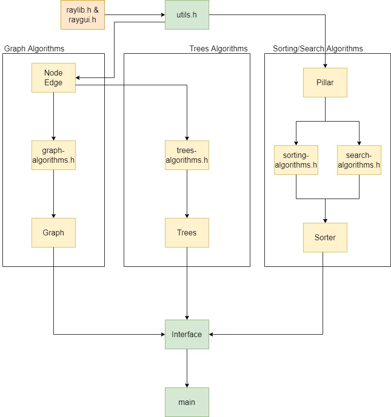

# Design Document

This file is responsible for better explaining the Low Level Design of this project and how the project works

## Table of Contents

1.  [Overview](#overview)
2.  [Utils.h](#utils.h)
3.  [Node Class](#node-class)
4.  [Edge Class](#edge-class)
5.  [Pillar class](#pillar-class)
6.  [Other Functions](#other-functions)
7.  [GraphInterface class](#fraph-class)
8.  [SortInterface class](#sorter-class)
9.  [Search class](#search-class)
10. [MainInterface class](#interface-class)

## Overview

As explanted before this project is going to use Raylib 4.0.0 and RayGui 3.1. Headers that will import these libraries are going to be located in the `/include` folder.

The main components of this project are:

- The main function, that will create an MainInterface object
- The MainInterface object which will take care of:
  - drawing the main menu to the screen
  - receiving the information from the user. This will decide which type of algorithm object (graph etc.) to build and launch
- The GraphInterface Structure will contain 3 Classes (Node, Edge, GraphInterface) and more functions for animation. This Structure will take care of displaying the unique header and processing the information from the user
- The Sorting and Search Structures have the same description the the GraphInterface Structure one

## Utils.h

This file will be responsible for defining all the Colors that we are going to use in the project, all the enumerators and the libraries.

**Important Variables**
ANIMATION_FPS -> set to 30 by default. Change this variables to get a different speed of the animations
MAX_PILLARS and MIN_PILLARS -> set to 100 and 20, respectively, represent the maximum and the minimum number of pillars that can be displayed. Change them as you like.
All the `enums` represent ether an element's color or the options that was selected by the user.

## Node Class

The Node class will represent the nodes that will be used for the GraphInterface related algorithms.

#### Node(int value, int coord_x, int coord_y, int id = -1);

The constructor will set a node's value, coordinates on the canvas and the id.
The id will of a node will be used when trying to find the distance. This id will be set set by the owner, when building the node.

#### draw(float radius);

This function will be responsible with drawing the Node to the screen. It will also set the class's private variable.

#### bool is_selected(int x, int y);

When the user clicks on the screen we want to have a way of identifying if a node was clicked on. This function should use the class's private variable mentioned above.

## Pillar Class

The Pillar class will represent the nodes that will be used for the SortInterface and SearchInterface related algorithms.

#### Node(int value);

The constructor will set a pillar's value. This value can be changed in the future as the field will be public;

#### draw(float radius);

This function will be responsible with drawing the Node to the screen. It will also set the class's private variable.

#### void change_state(color_state);

This will change the state of the pillar. The states can be NORMAL, SELECTED or MOVED. By changing the state, we will also change the color of the pillar in order to create the desired animation.

## Other Functions

There is a folder named `standalone-functions`. Here there will be the functions that will create the animation and will be responsible for the actual implementation of the algorithm.

## GraphInterface, SortInterface and Search Classes

The GraphInterface class will be responsible for receiving/processing the input from the user, storing the adjacency matrix (as a std::vector<std::vector\<float>>) and the list of Nodes (as a std::vector\<Node>).

#### void draw();

Will be responsible for taking the input from the user (adding nodes, adding edges, starting the algorithm), drawing the buttons and drawing the animation/the state of the process.

## MainInterface Class

Will be the main class of the program that will display the main menu and taking the input of what class should be initialized.
